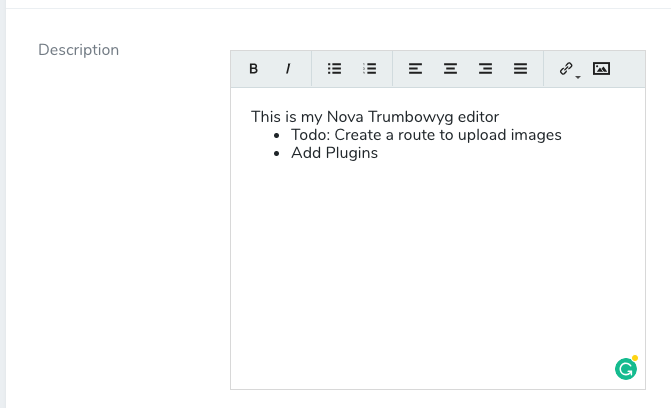

# Nova Trumbowyg editor field
Laravel Nova Trumbowyg Editor field.

## Installation

Just install the package in to a Laravel app that uses Nova via composer:

```
composer require alfonsobries/nova-trumbowyg
```


## Simple Usage:
```php
NovaTrumbowyg::make('Field Name')
```

## Advanced Usage:
You can pass any existing Trumbowyg option. Consult the [Trumbowyg documentation](https://alex-d.github.io/Trumbowyg/documentation/#basic-options) to view the list of all the available options.

```php
NovaTrumbowyg::make('Description')
    ->options(['btns' => [['bold', 'italic'], ['link']]])
```

## Screenshot


## License
The MIT License (MIT). Please see [License File](LICENSE) for more information.
